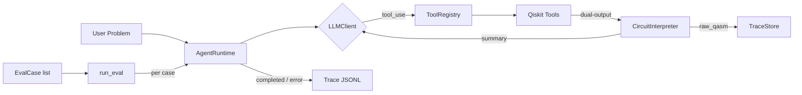

# qarc — Quantum Agent Runtime Core


A minimal, framework-free agentic loop that lets an LLM reason over quantum circuits using Qiskit tool calls. No LangChain, no LangGraph, no Pydantic AI — just a custom tool registry, a JSON trace store, and interchangeable LLM clients.

---

## Architecture



**Key design decisions:**
- `ToolRegistry` introspects Python type hints (including `list[int]`) to auto-generate Anthropic-style JSON schemas
- `CircuitInterpreter` returns `{"summary": {...}, "raw_qasm": "..."}` — summary goes to the LLM, raw QASM goes to the trace store only (keeps context window small)
- `TraceStore` appends one JSONL record per agent step; traces are human-readable and queryable
- LLM backend is a pluggable interface — `OllamaClient`, `AnthropicClient`, or `FakeLLMClient` for tests
- `run_eval()` runs the same query against a list of `EvalCase` backends and returns structured `EvalResult` records

---

## Quick Start

```bash
git clone https://github.com/Sri-Harsha-T/qarc.git
cd qarc
uv sync
```

**Run with scripted demo (no API key, no Ollama required):**
```bash
uv run python scripts/verify_demos_q.py      # circuit demos (8 assertions)
uv run python scripts/verify_eval_q.py       # eval harness (3 assertions)
```

**Run multi-algorithm eval with Ollama (local model):**
```bash
uv run python scripts/run_eval.py            # Grover / QFT / QAOA vs. local model
```

**Run with Anthropic API:**
```bash
ANTHROPIC_API_KEY=sk-... DEMO_PROVIDER=anthropic uv run python -c "
from qarc.runtime import AgentRuntime
from qarc.anthropic_client import AnthropicClient
runtime = AgentRuntime(client=AnthropicClient(), max_steps=10)
result = runtime.run('Build a 4-qubit QFT circuit and count its resources.')
print(result['status'])
"
```

---

## Sample Output

Scripted demo — 4-qubit Quantum Fourier Transform:

```
=== Trace: 6baa5787_1779961942 ===
Problem : Build and analyze a 4-qubit Quantum Fourier Transform circuit.
Model   : scripted-demo
Status  : completed

Step 0 [create_qft_circuit]
  Input : {"n_qubits": 4}
  Result: 4 qubits, depth 8, 12 gates total
Step 1 [count_resources]
  Input : {"qasm_str": "OPENQASM 2.0;\n..."}
  Result: 4 qubits, depth 26, 40 gates total

Final Answer:
  Resource estimate for 4-qubit QFT:
- Algorithm: Quantum Fourier Transform
- Qubits required: 4
- Circuit depth (basis gates): 26
- Total gates: 40
- T-count: 0

Metadata: 2 steps, 2 tool calls, 0.129s
```

---

## Project Structure

```
src/qarc/
├── registry.py          # ToolRegistry — schema generation from type hints (list[int] supported)
├── runtime.py           # AgentRuntime — agentic loop (tool_use → tool_result → ...)
├── interpreter.py       # CircuitInterpreter — dual-output: summary + raw_qasm
├── trace.py             # TraceStore — append-only JSONL trace writer
├── viewer.py            # render_trace() — human-readable trace display
├── eval.py              # run_eval() — multi-backend eval runner (EvalCase / EvalResult)
├── client.py            # LLMClient protocol (interface)
├── ollama_client.py     # OllamaClient — native /api/chat, think=False
├── anthropic_client.py  # AnthropicClient — messages API + tool_use
└── tools/
    ├── circuit.py       # create_grover_circuit, create_qft_circuit, create_qaoa_circuit
    ├── resources.py     # count_resources — T-count, gate counts, depth
    └── transpile.py     # transpile_circuit — Qiskit transpiler, opt levels 0–3

scripts/
├── verify_demos_q.py         # Gate Q — 8-assertion end-to-end verification
├── verify_eval_q.py          # Gate Q — eval harness (3 assertions: Grover/QFT/QAOA)
├── run_eval.py               # Multi-algorithm eval (Grover/QFT/QAOA) vs. configured backend
├── generate_example_traces.py # Canonical trace generation (scripted mode)
└── trace_viewer.py           # CLI trace viewer

traces/examples/
├── grover_demo.jsonl    # 6-qubit Grover, 2 iterations
├── qft_demo.jsonl       # 4-qubit QFT
└── compare_demo.jsonl   # Grover → count → transpile(opt=3) → count chain
```

---

## Design Decisions

All architecture decisions are documented in [`docs/adrs.md`](docs/adrs.md). Key choices:

| Decision | Choice | Reason |
|---|---|---|
| Framework | None | "Custom harness" claim must be total; no LangChain/LangGraph |
| QASM format | QASM 2.0 via `qiskit.qasm2` | `circuit.qasm()` removed in Qiskit 1.0 |
| Tool schemas | Introspected from type hints | No separate schema files to keep in sync; `list[int]` emits correct array schema |
| Context size | Summary only to LLM | Raw QASM (8 KB+) would exhaust model context |
| Test doubles | `FakeLLMClient` only | No `unittest.mock`; scripted responses + real tool calls |
| Eval harness | `run_eval()` + `EvalCase` | Same query against multiple backends; structured `EvalResult` for comparison |
| Property tests | `hypothesis` + `registry.call()` | Structural invariants (qubit count, gate positivity) verified across full input range |
| CI | uv + two Gate Q scripted steps | Reproducible, no API key required in CI |

---

## Evaluation Results

qarc includes a scoring engine that benchmarks LLM agent accuracy against Qiskit-computed expert baselines across 7 problems of escalating difficulty (4 tiers).

| Model | Pass Rate | Chain Correct | Mean Latency |
|-------|-----------|---------------|--------------|
| ollama/qwen3.5:9b | 3/7 (43%) | 4/7 | 197s |

| Problem | Tier | Result | Failure Mode |
|---------|------|--------|--------------|
| grover_3q_1iter | explicit | ❌ | `metric_mismatch` — gates 55 vs 49 expected |
| qft_4q | explicit | ✅ | correct |
| qaoa_ring4_p1 | explicit | ✅ | correct |
| grover_16_implicit | inference | ❌ | `agent_error` — can't derive n_qubits=4 from "16 elements" |
| qaoa_k3_p2 | inference | ✅ | correct — K₃ edge encoding solved |
| search_64_selection | selection | ❌ | `agent_error` — can't identify Grover for unstructured search |
| qft_vs_grover_4q | comparison | ❌ | `chain_incomplete` — runs one chain, not both |

Full report: [`reports/eval_report.md`](reports/eval_report.md)  
Baselines: [`baselines/baselines.json`](baselines/baselines.json)

### Key Findings

qwen3.5:9b scores perfectly on QFT and ring-graph QAOA (explicit parameters), and correctly encodes K₃ graph edges for the inference-tier QAOA problem. It fails problems requiring algorithm reasoning: it cannot infer `n_qubits = log₂(16) = 4` from a problem description (`grover_16_implicit`, `agent_error`), cannot identify Grover's algorithm as appropriate for "unstructured search" (`search_64_selection`), and cannot coordinate two independent tool chains for the comparison problem. The `metric_mismatch` on `grover_3q_1iter` is a tool-chaining error: the model called `transpile_circuit` before `count_resources`, shifting gate counts from 49 to 55 — exactly the class of error this eval was built to detect.

---

## Extending qarc

**Add a new tool:**
```python
# src/qarc/tools/my_tool.py
from qarc.registry import registry

@registry.register
def my_quantum_tool(qasm_str: str, param: int) -> dict:
    """One-line docstring shown to the LLM."""
    # ... implementation
    return {"summary": {...}, "raw_qasm": qasm_str}
```

The registry auto-generates the Anthropic tool schema from the function signature. Type hints are required.

**Swap LLM backend:**
```python
from qarc.client import LLMClient

class MyClient:
    def chat(self, messages, tools): ...
    def extract_tool_calls(self, response): ...
    def extract_text(self, response): ...
    def model_name(self): return "my-model"
```

---

## Development

```bash
uv sync --all-extras             # install dev deps (includes hypothesis)
uv run pytest tests/ -v          # 99 tests, 0 warnings
uv run ruff check src/ tests/    # lint
uv run mypy src/qarc/            # type check
uv run python scripts/verify_demos_q.py  # Gate Q — circuit demos (8/8 assertions)
uv run python scripts/verify_eval_q.py  # Gate Q — eval harness (3/3 assertions)
```
