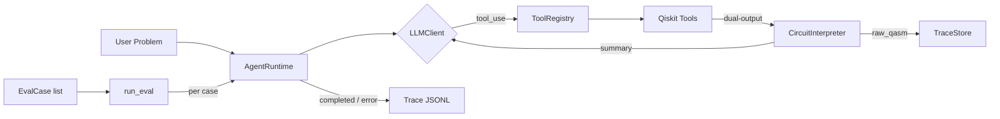

# qarc — Quantum Agent Runtime Core


A minimal custom agent loop that lets an LLM reason over quantum circuits using Qiskit tool calls. Built on a hand-rolled tool registry, a JSON trace store, and interchangeable LLM clients — no framework abstractions.

---

## Architecture



**Key design decisions:**
- `ToolRegistry` introspects Python type hints (including `list[int]`) to auto-generate Anthropic-style JSON schemas
- `CircuitInterpreter` returns `{"summary": {...}, "raw_qasm": "..."}` — summary goes to the LLM, raw QASM goes to the trace store only (keeps context window small)
- `TraceStore` appends one JSONL record per agent step; traces are human-readable and queryable
- LLM backend is a pluggable interface — `OllamaClient`, `AnthropicClient`, or `FakeLLMClient` for tests
- `run_eval()` runs the same query against a list of `EvalCase` backends and returns structured `EvalResult` records

---

## Quick Start

```bash
git clone https://github.com/Sri-Harsha-T/qarc.git
cd qarc
uv sync
```

**Run with scripted demo (no API key, no Ollama required):**
```bash
uv run python scripts/verify_demos_q.py      # circuit demos (8 assertions)
uv run python scripts/verify_eval_q.py       # eval harness (3 assertions)
```

**Run multi-algorithm eval with Ollama (local model):**
```bash
uv run python scripts/run_eval.py            # Grover / QFT / QAOA vs. local model
```

**Run with Anthropic API:**
```bash
ANTHROPIC_API_KEY=sk-... DEMO_PROVIDER=anthropic uv run python -c "
from qarc.runtime import AgentRuntime
from qarc.anthropic_client import AnthropicClient
runtime = AgentRuntime(client=AnthropicClient(), max_steps=10)
result = runtime.run('Build a 4-qubit QFT circuit and count its resources.')
print(result['status'])
"
```

---

## Sample Output

Scripted demo — 4-qubit Quantum Fourier Transform:

```
=== Trace: 6baa5787_1779961942 ===
Problem : Build and analyze a 4-qubit Quantum Fourier Transform circuit.
Model   : scripted-demo
Status  : completed

Step 0 [create_qft_circuit]
  Input : {"n_qubits": 4}
  Result: 4 qubits, depth 8, 12 gates total
Step 1 [count_resources]
  Input : {"qasm_str": "OPENQASM 2.0;\n..."}
  Result: 4 qubits, depth 26, 40 gates total

Final Answer:
  Resource estimate for 4-qubit QFT:
- Algorithm: Quantum Fourier Transform
- Qubits required: 4
- Circuit depth (basis gates): 26
- Total gates: 40
- T-count: 0

Metadata: 2 steps, 2 tool calls, 0.129s
```

---

## Project Structure

```
src/qarc/
├── client.py                 # LLMClient protocol (interface)
├── registry.py               # ToolRegistry — schema generation from type hints (list[int] supported)
├── runtime.py                # AgentRuntime — custom agentic loop (tool_use → tool_result → ...)
├── interpreter.py            # CircuitInterpreter — dual-output: summary + raw_qasm
├── trace.py                  # TraceStore — append-only JSONL trace writer
├── viewer.py                 # render_trace() — human-readable trace display
├── eval.py                   # run_eval() — multi-backend eval runner (EvalCase / EvalResult)
├── scoring.py                # scoring engine — metric extraction + pass/fail against baselines
├── baselines.py              # baseline loader — Qiskit-computed ground truth (baselines.json)
├── report.py                 # report generator — markdown eval reports
├── ollama_client.py          # OllamaClient — native /api/chat, think=False
├── anthropic_client.py       # AnthropicClient — messages API + tool_use
├── openai_compatible_client.py # OpenAICompatibleClient — Groq / Gemini / OpenAI-compat backends
└── tools/
    ├── circuit.py            # create_grover_circuit, create_qft_circuit, create_qaoa_circuit
    ├── resources.py          # count_resources — T-count, gate counts, depth
    └── transpile.py          # transpile_circuit — Qiskit transpiler, opt levels 0–3

scripts/
├── verify_gate_q.py          # Gate Q — end-to-end smoke test (circuit demos + eval harness)
├── verify_demos_q.py         # Gate Q — 8-assertion circuit demo verification
├── verify_eval_q.py          # Gate Q — eval harness (3 assertions: Grover/QFT/QAOA)
├── verify_scoring_q.py       # Gate Q — scoring engine assertions
├── verify_trace_q.py         # Gate Q — trace store assertions
├── verify_qaoa_q.py          # Gate Q — QAOA-specific circuit assertions
├── run_eval.py               # Multi-algorithm eval vs. configured backend
├── run_scored_eval.py        # Full scored eval — 7 problems × N models → markdown report
├── generate_baselines.py     # Qiskit-computed baseline generation (writes baselines/baselines.json)
├── generate_example_traces.py # Canonical trace generation (scripted mode)
├── demo_qaoa.py              # QAOA demo script
└── trace_viewer.py           # CLI trace viewer

traces/examples/
├── grover_demo.jsonl    # 6-qubit Grover, 2 iterations
├── qft_demo.jsonl       # 4-qubit QFT
└── compare_demo.jsonl   # Grover → count → transpile(opt=3) → count chain
```

---

## Design Decisions

All architecture decisions are documented in [`docs/adrs.md`](docs/adrs.md). Key choices:

| Decision | Choice | Reason |
|---|---|---|
| Agent loop | Custom (`AgentRuntime`) | Direct control over tool dispatch, step budget, and trace format; framework abstractions would hide the loop |
| QASM format | QASM 2.0 via `qiskit.qasm2` | `circuit.qasm()` removed in Qiskit 1.0 |
| Tool schemas | Introspected from type hints | No separate schema files to keep in sync; `list[int]` emits correct array schema |
| Context size | Summary only to LLM | Raw QASM (8 KB+) would exhaust model context |
| Test doubles | `FakeLLMClient` only | No `unittest.mock`; scripted responses + real tool calls |
| Eval harness | `run_eval()` + `EvalCase` | Same query against multiple backends; structured `EvalResult` for comparison |
| Property tests | `hypothesis` + `registry.call()` | Structural invariants (qubit count, gate positivity) verified across full input range |
| CI | uv + two Gate Q scripted steps | Reproducible, no API key required in CI |

---

## Evaluation Results

qarc includes a scoring engine that benchmarks LLM agent accuracy against Qiskit-computed expert baselines across 7 problems of escalating difficulty (4 tiers).

| Model | Pass Rate | Chain Correct | Mean Latency | Phase |
|-------|-----------|---------------|--------------|-------|
| groq-llama70b/llama-3.3-70b-versatile | 3/7 (43%) | 4/7 | 828s | 009 |
| gemini-flash/gemini-2.0-flash | 0/7 (0%) | 0/7 | 481s | 009 |
| ollama/qwen3.5:9b | 3/7 (43%) | 4/7 | 181s | 010 |

| Problem | Tier | Groq-70B (ph009) | Gemini Flash (ph009) | qwen3.5 (ph010) |
|---------|------|----------|--------------|---------|
| grover_3q_1iter | explicit | ✅ correct | ❌ agent_error | ❌ metric_mismatch (got 28, exp 49) |
| qft_4q | explicit | ✅ correct | ❌ agent_error | ✅ correct |
| qaoa_ring4_p1 | explicit | ✅ correct | ❌ agent_error | ✅ correct |
| grover_16_implicit | inference | ❌ agent_error | ❌ agent_error | ❌ agent_error |
| qaoa_k3_p2 | inference | ❌ wrong_params | ❌ agent_error | ✅ correct |
| search_64_selection | selection | ❌ agent_error | ❌ agent_error | ❌ agent_error |
| qft_vs_grover_4q | comparison | ❌ chain_incomplete | ❌ chain_incomplete | ❌ chain_incomplete |

Full report: [`reports/eval_report.md`](reports/eval_report.md) (Groq + Gemini, phase-009) · [`reports/eval_report_ollama.md`](reports/eval_report_ollama.md) (Ollama, phase-010)  
Baselines: [`baselines/baselines.json`](baselines/baselines.json)

### Key Findings

**Tier differentiation is sharp and prompt-hardening did not close it.** Phase-010 added explicit parameter derivation instructions, multi-chain sequencing instructions, and a `lookup_algorithm` tool. qwen3.5:9b pass rate is unchanged at 3/7 after the phase-010 prompt changes. All inference, selection, and comparison problems still fail — the failure boundary is a model capability ceiling, not a prompt wording problem.

**Phase-010 changed the `grover_3q_1iter` failure mode without fixing it.** Previously qwen3.5:9b called `transpile_circuit` before `count_resources` (instruction violation), shifting gate counts from 49 to 55. With the strengthened "do not call transpile" instruction, it now returns 28 gates (below the baseline of 49). This is consistent with the model stopping at the raw circuit summary from `create_grover_circuit` rather than routing through `count_resources`. The instruction prevented one mistake and revealed a second one.

**Inference-tier `agent_error` is a step-budget failure, not a knowledge failure.** `grover_16_implicit` consumed 307s (near the 300s timeout per-step limit) and still hit `agent_error`. The model generates increasingly verbose reasoning at each step until the runtime terminates it. Adding `lookup_algorithm` and derivation prompts does not change this — the model needs a smaller reasoning budget or a tighter stop condition on unproductive steps.

**Comparison-tier `chain_incomplete` is a context-window problem.** `qft_vs_grover_4q` took 317s and still stopped after chain A. At that point in the conversation, the full QASM for the first algorithm is in the message history, consuming enough context that the model loses track of the second chain obligation. The multi-chain instruction is present but not effective at that context depth for a 9B parameter model.

**Gemini Flash (free tier) exhausts step budgets.** It generates verbose multi-paragraph explanations at each tool-use step, taking ~480s per problem at 6 max-steps — `agent_error` on all 7. This is a tool-use efficiency finding, not a capability finding.

---

## Extending qarc

**Add a new tool:**
```python
# src/qarc/tools/my_tool.py
from qarc.registry import registry

@registry.register
def my_quantum_tool(qasm_str: str, param: int) -> dict:
    """One-line docstring shown to the LLM."""
    # ... implementation
    return {"summary": {...}, "raw_qasm": qasm_str}
```

The registry auto-generates the Anthropic tool schema from the function signature. Type hints are required.

**Swap LLM backend:**
```python
from qarc.client import LLMClient

class MyClient:
    def chat(self, messages, tools): ...
    def extract_tool_calls(self, response): ...
    def extract_text(self, response): ...
    def model_name(self): return "my-model"
```

---

## Development

```bash
uv sync --all-extras             # install dev deps (includes hypothesis)
uv run pytest tests/ -v          # 99 tests, 0 warnings
uv run ruff check src/ tests/    # lint
uv run mypy src/qarc/            # type check
uv run python scripts/verify_demos_q.py  # Gate Q — circuit demos (8/8 assertions)
uv run python scripts/verify_eval_q.py  # Gate Q — eval harness (3/3 assertions)
```
